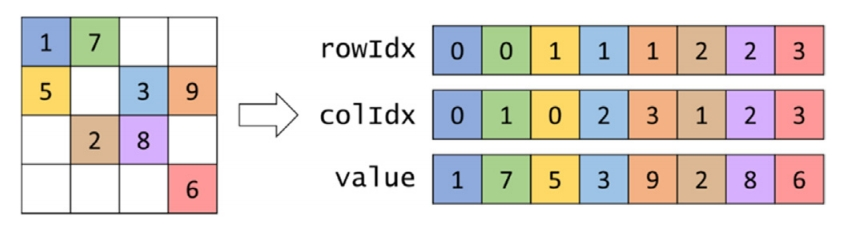
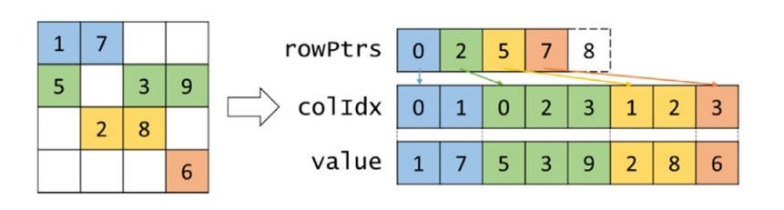
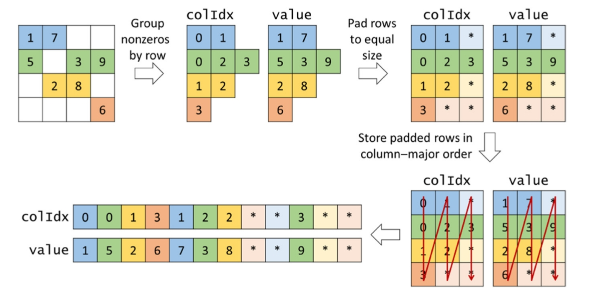
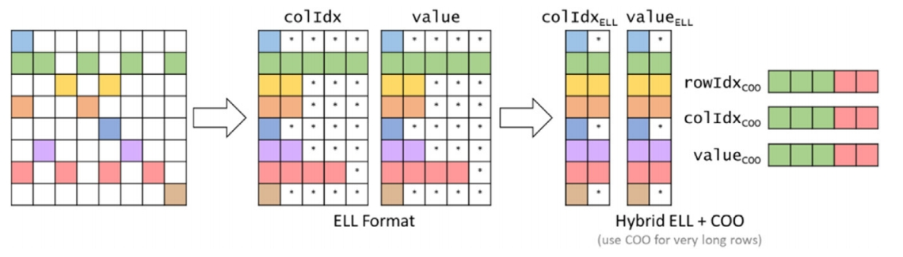
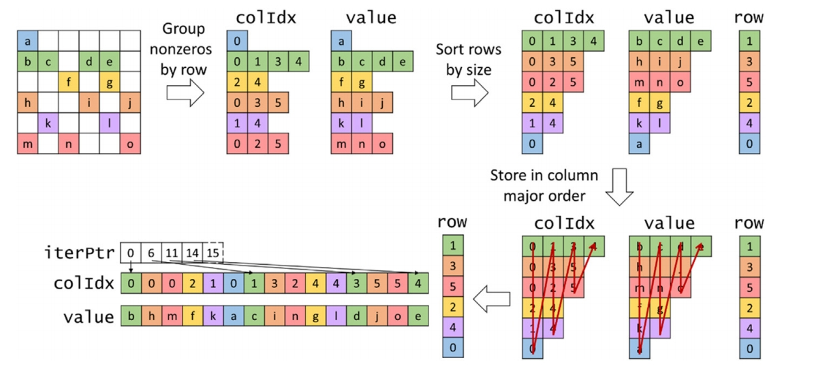

# 稀疏矩阵乘法
对于大型的矩阵，多数情况下是稀疏的，使用稀疏矩阵可以减少内存和计算次数。                 
这里关注向量矩阵乘法，即 `y = A*x`，A是mxn的矩阵，x是n行向量，y是m行向量，而A是稀疏的，一般非0元素占比1%以下。                        
不同的稀疏矩阵存储格式有不同的优缺点，这里主要是四种：              
- coo
- csr
- ell
- jds


## COO存储格式
该格式如图所示，使用三个数组存储所有的非零元素，分别存储行的idx，列的idx和对应的值。


**优点**：灵活性好，可以以任意顺序添加或者删除一个元素。GPU计算的kernel能够实现相邻元素取相邻的数据，合并读取。每个线程都处理一个元素，平衡。        
**缺点**：不能方便的取出一行或者一列的非零元素。使用`atomicAdd()`存在竞争。                

使用GPU计算，每个thread处理一个计算。使用`atomicAdd()`存在竞争。        
```cpp
__global__ void spmv_coo_kernel(int *rows, int *cols, float *vals, float *x, float *y, int nnz){
    int i = blockIdx.x * blockDim.x + threadIdx.x;
    if(i<nnz){
        int col_idx = cols[i];
        int row_idx = rows[i];

        atomicAdd(&y[row_idx], vals[i]*x[col_idx]);
    }
}

```

## CSR存储格式
该格式如图所示，使用三个数组存储所有的非零元素，一个数组存储每个行的开始位置，另外两个数组和COO一样，分别存储列的idx和值。



**优点**：存储上第一个数组比COO的第一个数组小很多。能够方便的读出一行非零元素。没有原子操作。
**缺点**：灵活性较差，不方便添加或者去除元素。相邻线程读取的数据不相邻，无法合并读取。每行的非零元素个数不同，计算不平衡。


使用GPU计算，每个thread处理一行计算。消除了COO计算中的原子操作。
```cpp
__global__ void spmv_csr_kernel(int *row_ptr, int *cols, float *vals, float *x, float *y, int m, int n){
    int i = blockIdx.x * blockDim.x + threadIdx.x;
    if(i<m){
        float sum = 0.0;
        for(int j=row_ptr[i]; j<row_ptr[i+1]; j++){ // row_ptr[i] is the start index of row i, row_ptr[i+1] is the start index of row i+1, its size is m+1 for the last element
            sum += vals[j]*x[cols[j]]; //sum the row i of all non-zero elements
        }
        y[i] = sum;
    }
}

```

## ELL存储格式

该格式如图所示，使用两个数组存储所有的非零元素，分别存储列的idx和值。需要将所有的行进行补齐，使得所有的行相同长度，都等于最大的非零行的个数。所以不需要记录行的idx，可以直接计算得到。



**优点**：存储上取决于非零元素分布是否均匀。添加元素相对于CSR灵活一些，只要不是最大的元素行，就可以直接在padding的位置添加。方便获取行和列的元素。相邻线程读取的数据相邻，合并读取。
**缺点**：存储上取决于非零元素分布是否均匀。


使用GPU计算，每个thread处理一行的计算，由于同一行的数据存储不是相邻的，而不同行是相邻的，所以是跳着处理。
```cpp
__global__ void spmv_ell_kernel(int *cols, float *vals, float *x, float *y, int m, int n, int max_length){
    int i = blockIdx.x * blockDim.x + threadIdx.x;
    if(i<m){
        float sum = 0.0;
        for(int j=0; j<max_length; j++){
            int idx = j*m+i;
            int col_idx = cols[idx]; // 0 padding, no impact on the result
            
            sum += vals[idx]*x[col_idx];
            
        }
        y[i] = sum;
    }
}

```


## ELL-COO 存储格式
为了解决ELL中出现少数的特别长的非零行的问题，使用COO进行优化。即将长的部分截取出来使用COO格式存储。




暂无GPU kernel实现。

## JDS存储格式
该格式如图所示，根据非零元素的个数对行进行排序，使用四个数组存储所有的非零元素。第一个存储每列idx的开始位置，两个数组分别存储列的idx和值。由于进行了排序，需要一个数组记录排序后的行的序号。和csr不同的是这是按列进行存储元素，即相邻元素是同一列的。




**优点**：存储上相对于ELL节省了。相邻线程读取的数据相邻，合并读取。
**缺点**：添加元素不灵活。同一个swap的线程处理的行的个数相近，所以相对平衡。


使用GPU计算，每个thread处理一行的计算，由于同一行的数据存储不是相邻的，而不同行是相邻的，所以是跳着处理。
```cpp
__global__ void spmv_jds_kernel(int *cols, float *vals, int *row_ptr, int *jds_ptr, float *x, float *y, int m, int n, int max_length){
    int i = blockIdx.x * blockDim.x + threadIdx.x;
    if(i<m){
        float sum = 0.0;
        int row_idx = row_ptr[i];
        for(int j=0; j<max_length; j++){
            int idx = jds_ptr[j]+i;
            if(idx<jds_ptr[j+1]){
                int col_idx = cols[idx];
                sum += vals[idx]*x[col_idx];
            }
        }
        
        y[row_idx] = sum;
    }
}

```

## 性能测试

original matrix-vector multiplication time: 984.900000 us
coo matrix-vector multiplication time: 31.600000 us, speedup: 31.167722
csr matrix-vector multiplication time: 15.300000 us, speedup: 64.372551
ell matrix-vector multiplication time: 8.900000 us, speedup: 110.662924
jds matrix-vector multiplication time: 14.100000 us, speedup: 69.851066

上面的结果显示ell最好，是因为随机生成的矩阵不同行非零元素个数相对平衡。总的来说，coo的效果相对差一些。

